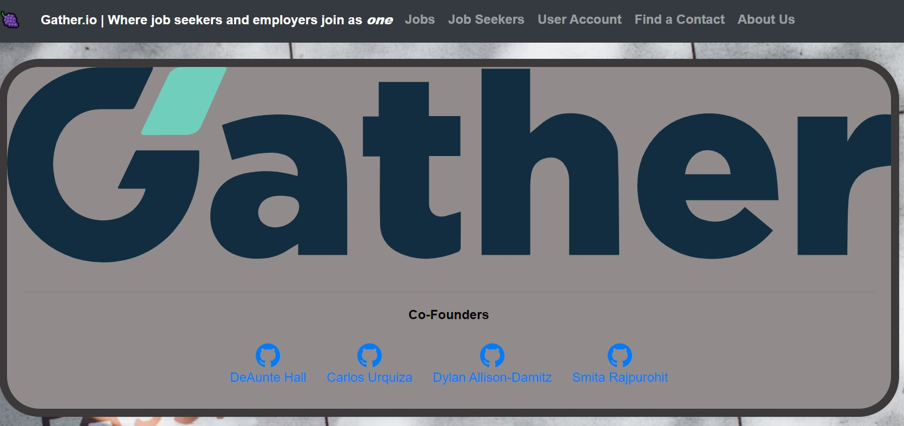
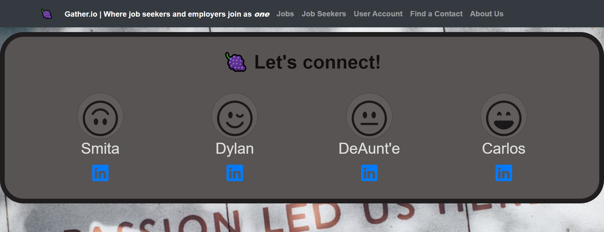

# Gather.io

## Name of Authors:

   * _Smita Rajpurohit_
   * _Dylan Allison-Damitz_
   * _DeAunt'e Hall_
   * _Carlos Urquiza_

## Description

_This MVC web application has the following functionality:_

* A user registered as a Job seeker can view jobs.

* A user registered as a Job seeker can search employer contacts via built-in ContactFinderAPI.

* A user registered as a Recruiter can add and delete jobs.

* A user registered as a Recruiter can view Job seeker information.

## Technologies used:

* C#

* MySQL

* MySQL Workbench

* .NET 5 SDK

* Git BASH

* ASP .NET CORE MVC

* Entity Framework Core

* My SQL Designer

* Identity

* Bootstrap

* Razor View Engine

* RESTful routing

* Fluent Validation

## Preview

 

## Setup/Installation Requirements

1. Download or clone the [https://github.com/smita-raj12/Gather.Solution](https://github.com/smita-raj12/Gather.Solution) to your local machine.

2. Download any Code Editor for your choice. (Here I used VSCode).

3. Open git BASH terminal and navigate to the Gather folder, within the directory
Run `dotnet restore` in the git BASH terminal to install dependencies. 

4. Create appsettings.json file in the Gather directory of Gather (run the command touch appsettings.json) and add the following code to the file: appsettings.json and create appsettings.json on ContactFinder add the follwing contacts database.

      
        {                                                    
         "ConnectionStrings":{                                                          
            "DefaultConnection": "Server=localhost;Port=3306;database=jobs_seekers;uid={YOUR-USER-NAME};pwd= {YOUR-PASSWORD};"                                        
          }                                                                                
        }                                                                               

5. For the API need to add the "ContactFinder" directory to another ContactFinder.solution folder. And create appsettings.json on ContactFinder add the follwing code.

        {                                                    
         "ConnectionStrings":{                                                          
            "DefaultConnection": "Server=localhost;Port=3306;database=contacts;uid={YOUR-USER-NAME};pwd= {YOUR-PASSWORD};"                                        
          }                                                                                
        }   

6. Remove the {YOUR_USERNAME_NAME} and {YOUR_PASSWORD} and fill in the the code snippet with your username for MySQL, and MySQL password Do not include the curly brackets in your code snippet of appsettings.json.                                       
  
7. Run  `dotnet ef database update`

8. Run `dotnet build` in the git BASH terminal to build, and run the project in the terminal. $ dotnet watch run

9. View the website by visiting localhost:5003/ in a new web browser tab (such as google chrome)

## Known bugs

None 

## License information with a copyright and date:

MIT License

Copyright (c) 2021 

Permission is hereby granted, free of charge, to any person obtaining a copy of this software and associated documentation files (the "Software"), to deal in the Software without restriction, including without limitation the rights to use, copy, modify, merge, publish, distribute, sublicense, and/or sell copies of the Software, and to permit persons to whom the Software is furnished to do so, subject to the following conditions:

The above copyright notice and this permission notice shall be included in all copies or substantial portions of the Software.

THE SOFTWARE IS PROVIDED "AS IS", WITHOUT WARRANTY OF ANY KIND, EXPRESS OR IMPLIED, INCLUDING BUT NOT LIMITED TO THE WARRANTIES OF MERCHANTABILITY, FITNESS FOR A PARTICULAR PURPOSE AND NONINFRINGEMENT. IN NO EVENT SHALL THE AUTHORS OR COPYRIGHT HOLDERS BE LIABLE FOR ANY CLAIM, DAMAGES OR OTHER LIABILITY, WHETHER IN AN ACTION OF CONTRACT, TORT OR OTHERWISE, ARISING FROM, OUT OF OR IN CONNECTION WITH THE SOFTWARE OR THE USE OR OTHER DEALINGS IN THE SOFTWARE.

## Contact information:
   
* Email: smita.raj12@gmail.com, dylandamitz@gmail.com, godsofolympus88@gmail.com, webquiza@gmail.com

